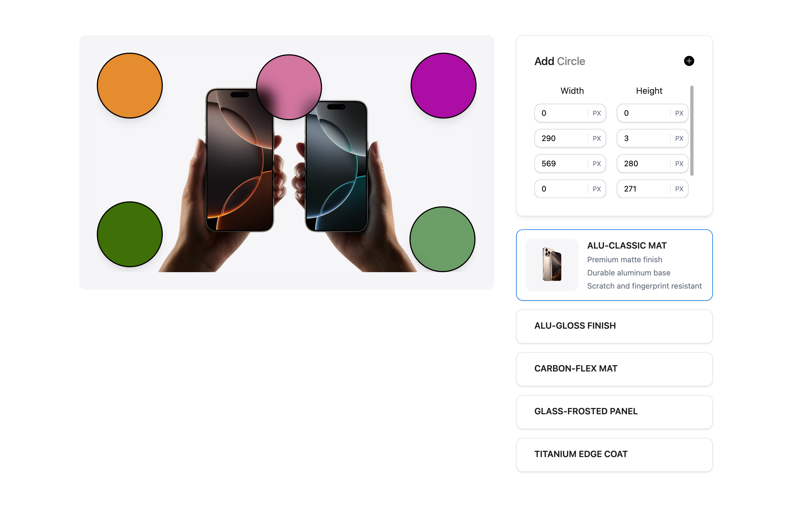

# Rueckwand Task Project

## Overview

This repository contains the implementation of the Rueckwand technical assessment task.



## Installation

Follow these steps to set up the project locally:

```bash
# Clone the repository
git clone https://github.com/Obaid3035/rueckwand-task.git

# Navigate to the project directory
cd rueckwand-task

# Install dependencies
npm install

# Start the development server
npm start
```

